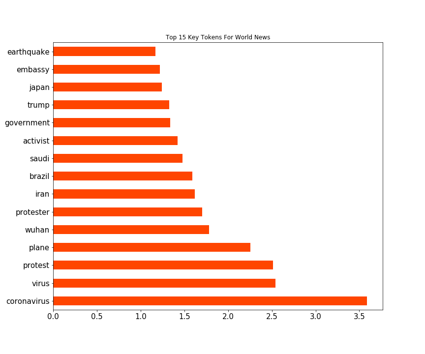

# Project 3 : Subreddit Classification

# Problem Statement

To classify whether a post is an uplifting news for reddit to boost positivity within the community, by recommending those uplifting news on the main page.

## Objective

1) To webscrape data from subreddit World News & Uplifting News through Json API

2) Clean and prepare data for classification model validation

3) Valid among 3 classification model: Logistic, Multinomial & Random Forest

4) Choose 1 model for to make prediction and inference

## Executive Summary

Reddit is home to thousands of community and plays an influencing role in the social media space along side Facebook, Twitter etc. It is therefore important for reddit to promote a positive outlook for its users among the perceived increases of negative news in recent current event. 

By adopting logistic regression classification model that is trained on posts from subreddit 'Uplifting News', reddit would be able to identify the good news among the news headline posted within reddit and recommend the posts to its users; thereby promoting a positive perspective that the world is not going to end. 

The logistic regression classification model is able to classify the post with an accuracy of 0.81, and perform as expected by using valid key tokens unique for each subreddit (World News & Uplifting News). 

Hence, reddit would be able to create a healthy & positive community if the model built in the project is adopted and trained on even more data to improve accuracy. 

### Contents:

- [Data Preparation](#1.-Data-Preparation)
- [Model Preparation](#2.-Model-Preparation)
- [Model Validation](#3.-Model-Validation)
- [Model Fitting & Prediction](#4.-Model-Fitting-&-Prediction)
- [Model Evaluation](#5.-Model-Evaluation)
- [Conclusion & Recommendations](#6.-Conclusion-&-Recommendations)

## Data Dictionary

| Features  | Type   | Description                                     |
|-----------|--------|-------------------------------------------------|
| Selftext  | Object | Content of each post from the subreddit in text |
| Title     | Object | Title of each post from the subreddit in text   |
| Subreddit | int    | 1 = World News, 0 = Uplifting News              |

[World News](https://www.reddit.com/r/worldnews/) : A place for major news from around the world, excluding US-internal news.

[Uplifting News](https://www.reddit.com/r/UpliftingNews/) : A place to read and share positive and uplifting, feel good news stories.

## Conclusion & Recommendations

Logistic Regression (LR) model was compared with Multinomial(MN) model for the model validation process, and LR was chosen as the better model for classification of the subreddit posts based on the score obtained through Gridsearch Cross Validation. 

| Score Comparision |       |
|-------------------|-------|
| **Cvec LR score:**    | **0\.89** |
| Tvec LR score:    | 0\.83 |
| Cvec Mn score:    | 0\.88 |
| Tvec Mn score:    | 0\.87 |

The LR classification model perform as expected, with an accuracy higher than that of baseline accuracy.

| Accuracy Comparison |       |
|---------------------|-------|
| Baseline Accuracy   | 0\.62 |
| **Model Accuracy**      | **0\.81** |

From the LR model, we are able to show the key tokens from each subreddit that contribute to classifying the posts from the coefficient. 

The key tokens make sense for World News as those are words that made the headline in the past month leading to 31 Jan 2020 (Which also happens to be rather negative terms, sadly). 

On the other hand, we can see some positivity from the Australian bushfire situation since related tokens appear in the uplifting news which telly with recent news. Hence, we can say that the logistic model is performing as expected. (Especially when dog is men's best friend!) 

At the same time, classifiying news related subreddit is also very time specific as key tokens from news vary from time to time. For example, using key token such as coronavirus in a post posted same time last year would be rather meaningless.

An evaluation of the LR model was also done, specifically on the False Negative classification. 

| Confusion Matrix |     |
|------------------|-----|
| True Negatives   | 92  |
| False Positives  | 11  |
| False Negatives  | 40  |
| True Positives   | 128 |

It is found that some of the key tokens for Uplifting News are contributing to the misclassfication of false negative as these tokens also appear on 40 posts from World News. However, since the objective of this project is to classify the post correctly into the right subreddit and the LR model is able to achieve higher than baseline accuracy, we can safely assume that the model is performing as expected.

**Recommendation**

Due to the limitation on the number of posts we can request using subreddit API, the model can only be trained on the most recent 500-700 posts. The model would be more accurate and less time-depedent if more historic data of the posts can be used to train the LR model. 